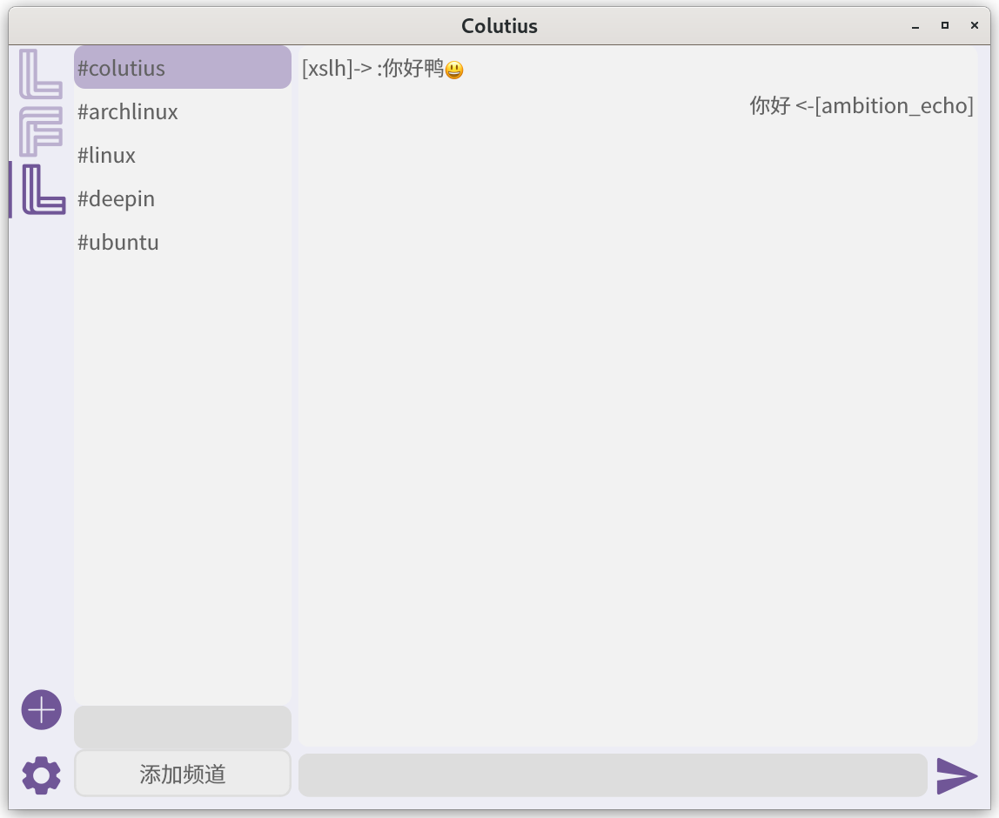

# Colutius


## [English](docs/README-EN.md/#colutius)

[](https://github.com/colutius/colutius-desktop/actions/workflows/CI.yml)
[](https://github.com/colutius/colutius-desktop/actions/workflows/Backup.yml)

[](https://github.com/colutius/colutius-desktop/blob/master/LICENSE)
[](https://github.com/colutius/colutius-desktop/releases)
[](https://github.com/colutius/colutius-desktop/releases)
[](https://github.com/colutius/colutius-desktop)

[](https://github.com/colutius/colutius-desktop/actions/workflows/CI.yml)
[](https://github.com/colutius/colutius-desktop/actions/workflows/Backup.yml)

[](https://github.com/colutius/colutius-desktop/blob/master/LICENSE)
[](https://github.com/colutius/colutius-desktop/releases)
[](https://github.com/colutius/colutius-desktop/releases)
[](https://github.com/colutius/colutius-desktop)

### 欢迎使用

```c++
   _____      _       _   _           
  / ____|    | |     | | (_)          
 | |     ___ | |_   _| |_ _ _   _ ___ 
 | |    / _ \| | | | | __| | | | / __|
 | |___| (_) | | |_| | |_| | |_| \__ \
  \_____\___/|_|\__,_|\__|_|\__,_|___/
  
  qDebug() << "Hello Colutius!";
```

### 一个跨平台，易用，美观的IRC客户端

## 软件截图


## 手动构建
- 克隆仓库
```bash
git clone --recursive https://github.com/colutius/colutius-desktop.git
cd colutius-desktop
```
- 开始构建
```bash
mkdir build
cd build
cmake ..
make
```
- 运行软件
```bash
./colutius-desktop
```
